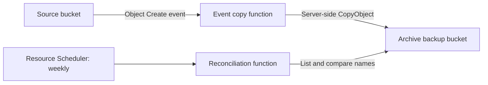

# OCI Object Copy Upon Write

This project maintains independent, retention-ready copies of objects written to OCI Object Storage buckets. It is designed for write-once data: copied objects are never deleted when their source is deleted.

## How it works

- **Event copy** is the fast path. An Object Storage create event invokes the function, which derives a destination name, creates the backup bucket when needed, and submits a server-side object copy.
- **Reconciliation** is the safety net. A weekly scheduled function lists both buckets in lexical order and submits copies only for source object names absent from the backup bucket. It does not perform per-object `HEAD` calls or copy object data through the function.

The backup bucket name is the source bucket name plus `BACKUP_BUCKET_SUFFIX`, which defaults to `-backup`. For example, `Customer_A` becomes `Customer_A_Glacier` when the suffix is `_Glacier`.

## Components

| Component | Purpose | Documentation |
| --- | --- | --- |
| Event copy function | Copies each newly-created source object to its backup bucket. | [Event copy function](src/ocifn-object-copy/README.md) |
| Reconciliation function | Weekly missing-object scan and backfill using list comparisons. | [Reconciliation function](src/ocifn-object-reconcile/README.md) |
| Shared setup | OCI Functions, networking, IAM, deployment prerequisites, and event rules. | [Setup guide](README_SETUP.md) |

## Operational model

The design intentionally does not propagate source deletes. OCI's native replication feature is therefore not a substitute: replication deletes destination objects when the source objects are deleted. The reconciliation function only fills missing destination objects; it does not overwrite existing backup objects.

Use function logs and OCI Functions metrics as the operational record. The JSON response body is useful for direct CLI or SDK invocation but is not displayed when the function is invoked by OCI Events or Resource Scheduler.

## Getting started

1. Complete the [shared setup](README_SETUP.md).
2. Deploy and configure the [event copy function](src/ocifn-object-copy/README.md).
3. Deploy and schedule the [reconciliation function](src/ocifn-object-reconcile/README.md).

## Initial Bucket Load

Bucket Replication does not copy existing objects.  Refer to the [Replication Docs](https://docs.oracle.com/en-us/iaas/Content/Object/Tasks/usingreplication.htm) for more details.  In order to copy 1M or more objects, you can use the reconciler function with a segment of the source data.  See the [README](./src/ocifn-object-reconcile/README.md) for details on command line invoke using async replication.  
