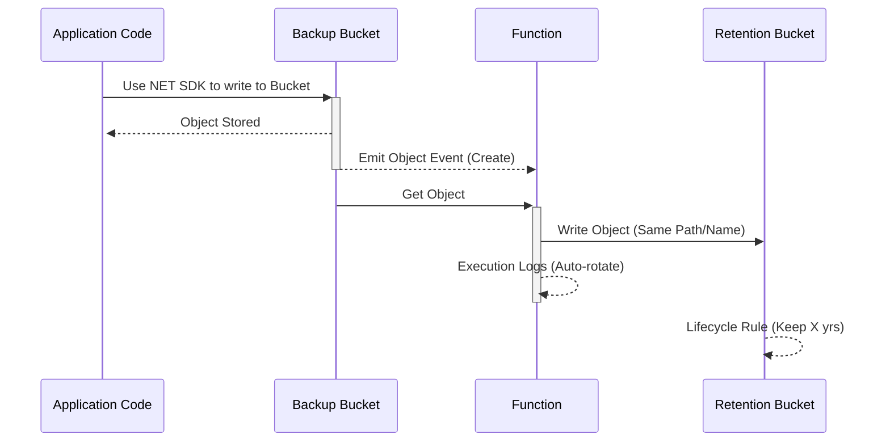

# Object Copy to Backup Bucket

This function is designed to operate on object events coming from write-only buckets.  Assuming there are bcukets being written to constantly from multiple places (console, API, SDK, S3).  Any time an object is written for the first time, we'd like to make a use this function to copy new objects to a completely separate bucket, named similarly to the original.  This way, any accidental or intentional deletes can be recovered.  The backup buckets for any source bucket using this function are located in the same compartment, which could be located away from operational compartments, and protected using Object Storage Retention Rules, for compliance purposes.

Set up involves:
1) Configuring OCI Functions and Container Registry
2) Deploying this function
3) Setting up permissions for the function to execute
4) Configuring Bucket Events and Event Rules for any bucket using this function

## Event Flow
The following sequence diageram summarizes the flow:



## Function App Create

Generally, you must follow one of the [Function Quickstarts](https://docs.oracle.com/en-us/iaas/Content/Functions/Tasks/functionsquickstartguidestop.htm), and have a VCN created for Functions use.  That part is not in scope for this README.

1. In the OCI Console, go to Developer Services > Functions > Applications.
2. Create a new application, specifying the VCN and subnet.
3. **Network Requirements:**
   - The function application's subnet must have access to an OCI Service Gateway.
   - Ensure a route rule exists to the Service Gateway in the subnet's route table.
   - Add an egress rule in the subnet's security list or network security group (NSG) to allow traffic to OCI Object Storage (Service Gateway CIDR or All Services).
4. Note the application name for deployment.

## Container Registry Setup

These steps are part of the [Function Quickstarts](https://docs.oracle.com/en-us/iaas/Content/Functions/Tasks/functionsquickstartguidestop.htm) and may differ based on your tenancy setup.

### Auth Token

Create an AUTH TOKEN for your user from the OCI Console, as the user that will do the function deployment.  If the tenancy uses a CIS Landing Zone, the application developer group should have this permission.  See [Permissions](#oci-permissions-for-deployment) for details on policy statements.

### Docker Login
Docker Login requires the AUTH Token you created, along with the correct docker login command from the place you plan to deploy the function from.  Either via Cloud Shell or Local shell, you must login based on the user you want to perform the deployment as.  This also depends on whether your user is in the Default Identity Domain, or a custom Domain.  Here are 2 examples:
```bash

# Docker Login to Default domain user (Ashburn) - get object namespace and use your user name
shell> docker login -u 'idxhzzdpc23m/Default/andrew@oracle.com' iad.ocir.io
<paste auth token>


# Docker Login to non-Default domain user (Ashburn) - get object namespace and use your user name
shell> docker login -u 'idxhzzdpc23m/CustomDomain/andrew@oracle.com' iad.ocir.io
<paste auth token>
```

## FN Context

You can use Cloud Shell or Local Functions context.  This is for a local FN Install.

1. Install Docker and ensure it is running (`docker version`, `docker run hello-world`).
2. Install the Fn Project CLI (`brew install fn` or use the install script).
3. Set up your OCI API signing key and profile in `~/.oci/config`.
4. Create and configure an Fn CLI context:
   - `fn create context <my-context> --provider oracle`
   - `fn use context <my-context>`
   - `fn update context oracle.profile <profile-name>`
   - `fn update context oracle.compartment-id <compartment-ocid>`
   - `fn update context api-url <api-endpoint>`
   - `fn update context registry <region-key>.ocir.io/<tenancy-namespace>/<repo-name-prefix>`
   - `fn update context oracle.image-compartment-id <compartment-ocid>`
5. Generate an Auth Token in OCI Console and log in to the OCI Registry:
   - `docker login -u '<tenancy-namespace>/<user-name>' <region-key>.ocir.io` (use Auth Token as password)

## Function Deployment

The function should be deployed into your function app, and must have the appropriate permissions set up before it can execute.

1. Initialize your function: `fn init --runtime python <function-name>`
2. Deploy the function: `fn -v deploy --app <application-name>`
3. Set function configuration (e.g., `BACKUP_COMPARTMENT_OCID`).

### Function Logging

It is advised to enable logging for the function.

## Local Invocation

You can test your function locally using a JSON file as input:

1. Create a file named `event.json` with your test event payload, for example:
    ```json
    {
       "eventType": "com.oraclecloud.objectstorage.createobject",
       "data": {
          "resourceName": "my-bucket/my-object.txt"
       }
    }
    ```
2. Run the function locally with:
    ```sh
    fn invoke <application-name> <function-name> --content-type application/json --input event.json
    ```
Replace `<application-name>` and `<function-name>` with your actual values.

## OCI Permissions for Deployment

In order to deploy the function, your user (API KEY) must have the permission to deploy functions:

```
allow <app-group> to manage repos in (tenancy or compartment)
allow <app-group> to manage functions-family in (tenancy or compartment)
```

Replace placeholders with your actual values.  It is likely that more or less will exist or be required to complete all actions, such as VCN creation.

## OCI Compartment for Backups
Assuming you want the backups in a new compartment, where the application users do not have permission to write or delete buckets or objects, you can create a new compartment in the tenancy in a location where only an administrator has permissions at all.  For example:
```
-root

--production

--production-backups (new)
```
Capture the name and OCID of the new compartment as they will be required for the function's dynamic group in the next step.  Also capture the production compartment name and OCID so that permissions can be given to the function as well.

## OCI Dynamic Group for Function

Create a dynamic group defined with matching rules (all):
```
resource.type = 'fnfunc'
any {resource.id = '<function-ocid>'}
```

You can add additional compartments to the any {} rule, so long as the resource.type rule is on its own line.

Note the name and identity domain of the dynamic group.

## OCI Permissions for Function 

The function requires the following minimum permissions to operate on Object Storage.  Note that the dynamic group that is defined by the function will only get the permissions shown below, which do not include write permissions on the source backups:

```
Allow dynamic-group <function-dynamic-group> to read repos in tenancy
Allow dynamic-group <function-dynamic-group> to manage buckets in compartment <backup-compartment-ocid> where request.permission != 'BUCKET_DELETE'
Allow dynamic-group <function-dynamic-group> to {OBJECT_READ, BUCKET_READ} in compartment <source-compartment-ocid> 
Allow dynamic-group <function-dynamic-group> to manage objects in compartment <backup-compartment-ocid> where request.permission != 'OBJECT_DELETE'
```

Replace placeholders with your actual values. These policies allow only the necessary actions for bucket creation/check and object copy, and do not allow deletes or updates.


## Event Configuration

1. In the OCI Console, navigate to the Object Storage bucket to monitor.
2. Go to the "Events" tab and create a new rule:
   - **Event Type:** Object - Create
   - **Target:** Oracle Functions (select your deployed function)
   - **Condition:** (Optional) Filter by object name or prefix as needed
3. Save the rule. New object writes to the bucket will now trigger the function.


## Logging and Troubleshooting

- View function logs in the OCI Console under Logging service.
- Use `fn invoke <application-name> <function-name>` for local testing.
- Check deployment output and logs for errors.

### Using rclone with OCI Object Storage

You can use [rclone](https://rclone.org/) to interact with OCI Object Storage for troubleshooting:

1. Configure rclone for OCI:
   ```sh
   rclone config
   # Choose 'n' for new remote, select 's3', and set provider to 'Other', then enter your OCI credentials and endpoint.
   ```
2. List objects in a bucket:
   ```sh
   rclone ls <remote>:<bucket-name>
   ```
3. Copy a file to a bucket:
   ```sh
   rclone copy <local-file> <remote>:<bucket-name>
   ```
4. See rclone documentation for more advanced usage.

---

## Advanced Logging (Placeholder)

- (To be documented: structured logging, log export, and advanced troubleshooting tips.)
